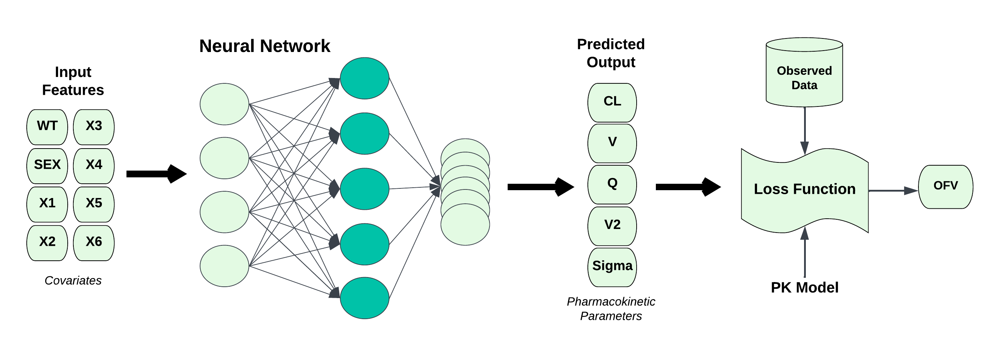

# wiens-acop-2023
Repository corresponding to ACOP14 poster - Wiens et al., "Illustrating Integration and Interpretation of the Deep Compartment Model Approach using Keras and R in a Population PK Modeling Analysis"

# Methodology Overview

This work extends the deep compartmental models proposed for PK analysis by [Janssen et al](https://ascpt.onlinelibrary.wiley.com/doi/10.1002/psp4.12808). We show examples of this work in R, tensorflow, and keras with several extensions. 
We fit the model with estimates for the RUV, Shapley values to interpret the model, and comparisons with NLME models with non-linear covariates. 

The `script/generic-data-analysis.Rmd` walks through a simple analysis pipeline, including setting up the data for use with tensorflow, creating a neural network, fitting model, and intepreting the model with Shapley values. 

# Setup

This code was developed under R 4.1.3. 

This code requires installation of python and tensorflow. Our process is in `script/python-setup.R`, however you likely will need different steps depending on your system. See the Rstudio documentation here: https://tensorflow.rstudio.com/

We suggest running the code within Rstudio and an Rproject. 

# Description of Files

- data/derived/nm-N10000-generic.csv: Dataset for use with NONMEM
- data/derived/pk-sim-N10000-generic.csv: Dataset in the analysis
- data/derived/pk.yml: Data specification file
- model/nonmem/template.ctl: NONMEM control stream template
- model/simmod/108b.cpp: mrgsolve simulation model
- script/bbr-helpers.R: Helper functions for bbr
- script/evidential-loss-functions.R: Loss functions for models with estimates for Sigma, the RUV.
- script/generic-dat-sim.R: Script to simulate the data
- script/generic-data-analysis.Rmd: Example analysis
- script/loss-functions-padding.R: Loss functions for use in keras; use a data structure that has been padded to account for varying numbers of observations
- script/loss-functions-two-cmpt.R: Implementation of two compartment PK models
- script/model-management-sims.Rmd: Script to run NLME models
- script/python-setup.R: Setup script for our python, reticulate, and tensorflow packages
- script/shapley-values.R: Functions for computing shapley values for these models

